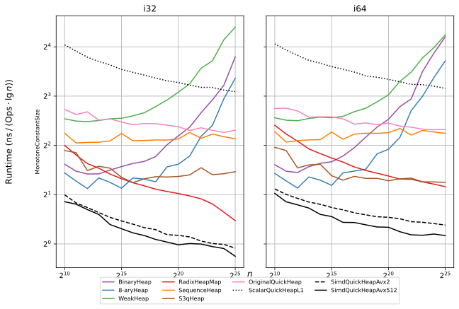

[](https://crates.io/crates/quickheap)
[](https://docs.rs/quickheap)
[](https://doi.org/10.48550/ARXIV.2604.25681)

# SimdQuickHeap: A fast SIMD-based priority queue

The SimdQuickHeap is, as the name suggests, a **fast priority queue**.
It has some similarities to QuickSelect, and uses SIMD for fast partitioning and
insertion of elements.

Unlike the classic binary heap (and $d$-ary heap variants), it is I/O-efficient
and **does not suffer from bad cache-locality** when the size of the queue exceeds
the cache.

Currently, it only supports `i32`, `u32`, `i64`, and `u64` keys and requires
either AVX2 or AVX-512.
See the preprint for details and benchmarks:

> SimdQuickHeap: The QuickHeap Reconsidered
> Johannes Breitling, Ragnar Groot Koerkamp, Marvin Williams, Arxiv 2026
> https://doi.org/10.48550/ARXIV.2604.25681

An older blogpost can be found here:
https://curiouscoding.nl/posts/quickheap.

## Example

``` sh
cargo add quickheap
```

```rust
let mut q = quickheap::SimdQuickHeap::<u64>::default();
q.push(4);
q.push(1);
q.push(7);
assert_eq!(q.pop(), Some(1));
q.push(7);
q.push(3);
assert_eq!(q.pop(), Some(3));
assert_eq!(q.pop(), Some(4));
assert_eq!(q.pop(), Some(7));
assert_eq!(q.pop(), Some(7));
assert_eq!(q.pop(), None);
```

## Results

Below you can see the results for 32-bit and 64-bit data when we first push `n`
elements and then how long it takes on average to do a pair of push and pop
operations. Note that the y-axis is normalized by `log_2(n)` as well.

The SimdQuickHeap is around 2x faster than the Radix heap, and up to 10x faster
than the binary heap and d-ary heap.



## Running the benchmarks

The main entrypoint for running all benchmarks is the [`run-all.sh`](run-all.sh)
script (or `just bench-all`). This runs `bench/example/{bench,bench_graph}.rs`
and writes to `bench/evals/data/*.csv`. (`just bench-small` runs a
smaller/faster subset.)

After that is done, `just plot-all` creates plots in `bench/evals/plots/*.{png,svg,pdf}`.

We benchmark both Rust libraries and (LLM-generated) FFI wrappers around
external C++ implementations that can be found in [ext/](ext/).
Submodules
containing the original C++ sources are in  nested `third_party` directories.
(Run `git submodule update --init --recursive` to initialize them.)

### Build errors
- The benchmarks need nightly Rust for some unstable convenience features.
- If you get linker errors, comment out the `.flag("-flto")` in `ext/{s3q-sys,sequence-heap-sys,boost-heap-sys}/build.rs`.
- To include boost implementations, add `-F boost`. In `spack`:
  - `spack env activate .` to activate the environment.
  - `spack find --path | grep boost` to get the path to the boost libraries
  - `export BOOST_INCLUDE_DIR=<result>/include`
  - `export CXX_FLAGS="-I$BOOST_INCLUDE_DIR"`

